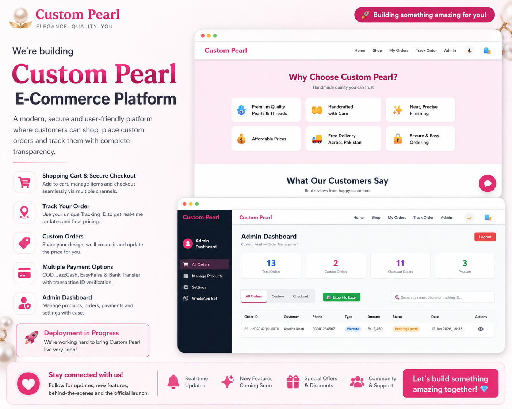
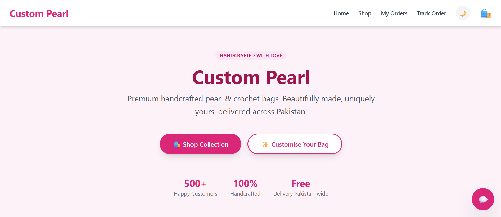
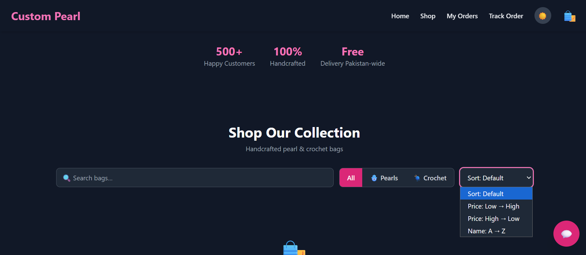
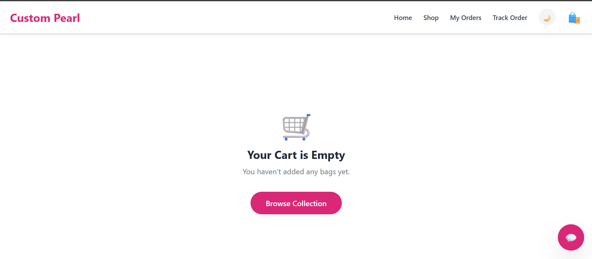
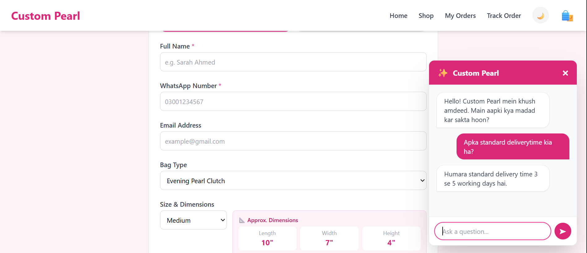
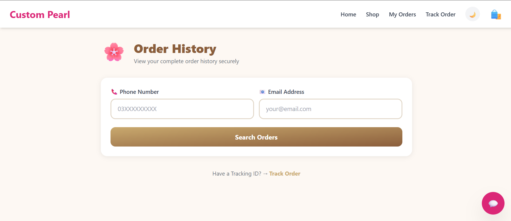
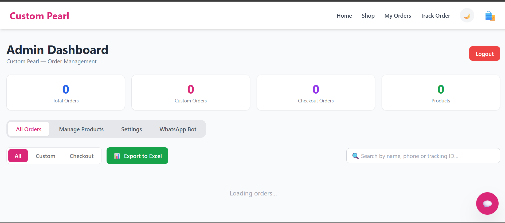

<div align="center">

# ✨ Custom Pearl

### A Production-Ready Full Stack E-Commerce Platform for Handmade Pearl & Crochet Bags

**Design • Customize • Order • Track — All in One Platform**

<p>


</p>



### 🌐 Live Website

[**Frontend**](https://custompearl.netlify.app) · [**Backend API**](https://custom-pearl-backend.onrender.com)

</div>

---

## 📖 Overview

**Custom Pearl** is a modern full-stack e-commerce platform built for selling handmade **Pearl** and **Crochet** bags, with complete customization support built in.

Unlike a traditional online store, customers can design their own bag — choosing category, bag type, colour, size, and dimensions, and even uploading inspiration images — before placing an order.

The platform also includes an **admin dashboard** for managing products and orders, an **order tracking system**, **WhatsApp & Instagram order confirmation**, secure authentication, and cloud-based media storage.

The application was originally built on **Microsoft SQL Server** and later migrated to **Firebase Firestore**, simplifying deployment while improving scalability and cloud integration.

---

## 🚀 Key Highlights

| | | |
|---|---|---|
| ✅ Production-Ready Full Stack App | ✅ Admin Dashboard | ✅ Firebase Authentication |
| ✅ Firebase Firestore Database | ✅ Cloudinary Image Upload | ✅ Custom Bag Builder |
| ✅ Shopping Cart & Checkout | ✅ Order Tracking | ✅ WhatsApp Integration |
| ✅ Instagram Integration | ✅ REST API Architecture | ✅ Responsive & Mobile Friendly |
| ✅ Dark Mode Support | | |

---

## 🎯 Main Features

| Module | Status |
|---|:---:|
| Product Catalog | ✅ |
| Product Details | ✅ |
| Shopping Cart | ✅ |
| Checkout | ✅ |
| Custom Bag Ordering | ✅ |
| Order Tracking | ✅ |
| Admin Dashboard | ✅ |
| Product Management | ✅ |
| Cloudinary Upload | ✅ |
| Firebase Authentication | ✅ |
| WhatsApp Confirmation | ✅ |
| Instagram Confirmation | ✅ |
| Responsive Design | ✅ |
| Dark Mode | ✅ |

---

## 🏗 System Architecture

```
                     Customer
                        │
                        ▼
                React Frontend
                        │
                 Axios REST API
                        │
                        ▼
             Node.js + Express Server
                        │
        ┌───────────────┼────────────────┐
        │               │                │
        ▼               ▼                ▼
    Firebase        Cloudinary       WhatsApp
    Firestore      Image Storage    Integration
        │
        ▼
  Admin Dashboard
```

---

## 📸 Project Preview

### 🏠 Home Page


### 🌗 Home — Filters & Dark Theme


### 🛒 Shopping Cart


### 🎨 Custom Bag Builder & Chatbot


### 📦 Order Tracking


### 👨‍💼 Admin Dashboard


---

## 💡 Why Custom Pearl?

Most handmade bag businesses rely on manual communication through social media, which makes order management slow and difficult.

Custom Pearl digitizes this entire workflow by providing:

- A professional online storefront
- Product management system
- Customer order management
- Personalized bag customization
- Secure admin dashboard
- Real-time order tracking
- Social media order confirmation
- Cloud-based image storage

The result is a smoother shopping experience for customers and a more efficient management system for business owners.

---

## 🛍 Customer Features

### 🏠 Home Page
- Modern landing page
- Featured products & best sellers
- Fully responsive design
- Dark mode support

### 👜 Product Catalog
- Browse Pearl bags
- Browse Crochet bags
- Search & filter by category
- Detailed product pages

### 🎨 Custom Bag Builder
Instead of buying a predefined bag, customers can design their own:
- Select category
- Select bag type
- Select size
- Choose colour
- Add a custom description
- Upload an inspiration image
- Enter contact information
- Generate a unique tracking ID

### 🛒 Shopping Cart
- Add / remove products
- Update quantity
- Calculate total price
- Continue shopping or proceed to checkout

### 💳 Checkout System
- Cash on Delivery
- Customer details & shipping address
- Order summary
- Automatic tracking ID generation

### 📦 Order Tracking
Every order receives a unique tracking ID, for example:

```
PRL-5H72KX
CPO-9F41LM
```

Customers can check current status, view order progress, and verify their tracking ID.

### 💬 WhatsApp Confirmation
Customers can instantly open WhatsApp, send order details, share the tracking ID, and confirm the purchase.

### 📸 Instagram Confirmation
Customers can also open Instagram, copy the order details, and send a DM to confirm.

---

## 👨‍💼 Admin Dashboard

### 📦 Product Management
- Add / edit / delete products
- Upload images
- Manage categories
- Update prices

### 🛍 Checkout Orders
- View and search orders
- Change order status
- Track customers
- View payment information

### 🎨 Custom Orders
- View custom requests & uploaded inspiration images
- Read customer notes
- Accept / reject orders
- Update status

### 🔒 Secure Authentication
Only authenticated administrators can access the dashboard, product management, order management, and customer information — powered by Firebase Authentication.

---

## ☁ Cloudinary Integration

Instead of storing files locally, Custom Pearl uploads customer images directly to Cloudinary, giving:

- Faster loading
- Cloud storage
- Automatic CDN
- Better performance
- Optimized images

---

## 🔥 Firebase Integration

**Authentication** — admin login & secure sessions

**Firestore** — stores products, checkout orders, custom orders, and tracking information

**Benefits** — real-time database, cloud hosted, scalable, no local database required

### 📂 Database Collections

| Collection | Purpose |
|---|---|
| `Products` | Store all products |
| `CheckoutOrders` | Customer purchases |
| `CustomOrders` | Custom bag requests |
| `Admins` | Admin authentication |
| `Users` | Registered users |

---

## 🔄 Order Workflow

```
Customer → Browse Products → Add to Cart → Checkout
   → Tracking ID Generated → Firestore
   → Admin Dashboard → Order Status Updated
   → Customer Tracks Order
```

## 🎨 Custom Order Workflow

```
Customer → Custom Bag Form → Upload Image → Enter Details
   → Generate Tracking ID → Firestore
   → Admin Reviews Request → Order Confirmed
```

---

## 📈 Performance Highlights

- Responsive layout
- Fast Firestore queries
- Cloudinary-optimized images
- REST API architecture
- Mobile friendly
- Clean, component-based React architecture
- Production-ready backend
- Secure admin access
- Modular project structure

---

## 🛠 Technology Stack

**Frontend**

| Technology | Purpose |
|---|---|
| React.js | User interface |
| React Router | Routing |
| Axios | API communication |
| Tailwind CSS | Styling |
| Context API | State management |

**Backend**

| Technology | Purpose |
|---|---|
| Node.js | Runtime environment |
| Express.js | REST API |
| Multer | File upload |
| Cloudinary | Image storage |
| CORS | Cross-origin requests |
| dotenv | Environment variables |

**Database**

| Technology | Purpose |
|---|---|
| Firebase Firestore | NoSQL cloud database |
| Firebase Authentication | Secure admin login |

**Deployment**

| Service | Purpose |
|---|---|
| Netlify | Frontend hosting |
| Render | Backend hosting |
| GitHub | Version control |

---

## 📂 Project Structure

```
Custom-Pearl/
│
├── client/
│   ├── public/
│   ├── src/
│   │   ├── assets/
│   │   ├── components/
│   │   ├── context/
│   │   ├── hooks/
│   │   ├── pages/
│   │   ├── services/
│   │   ├── config/
│   │   └── App.jsx
│
├── server/
│   ├── middleware/
│   ├── services/
│   ├── uploads/
│   ├── db.js
│   ├── firebase.js
│   ├── server.js
│   └── package.json
│
└── README.md
```

---

## 🚀 Getting Started

**1. Clone the repository**
```bash
git clone https://github.com/abdulqadeersikandar-pixel/Custom-Pearl.git
```

**2. Move into the project**
```bash
cd Custom-Pearl
```

**3. Install frontend dependencies**
```bash
cd client
npm install
```

**4. Install backend dependencies**
```bash
cd ../server
npm install
```

**5. Start the backend**
```bash
npm start
```

**6. Start the frontend**
```bash
npm run dev
```

---

## ⚙ Environment Variables

**Server (`.env`)**
```env
PORT=5000

FIREBASE_PROJECT_ID=
FIREBASE_PRIVATE_KEY=
FIREBASE_CLIENT_EMAIL=

CLOUDINARY_CLOUD_NAME=
CLOUDINARY_API_KEY=
CLOUDINARY_API_SECRET=

JWT_SECRET=

EMAIL_USER=
EMAIL_PASS=
```

---

## 📡 REST API Reference

### Products
| Method | Endpoint | Description |
|---|---|---|
| `GET` | `/api/products` | Get all products |
| `POST` | `/api/products` | Create a product |
| `PUT` | `/api/products/:id` | Update a product |
| `DELETE` | `/api/products/:id` | Delete a product |

### Checkout
| Method | Endpoint | Description |
|---|---|---|
| `POST` | `/api/checkout-orders` | Place a checkout order |
| `GET` | `/api/checkout-orders` | Get admin orders |
| `PUT` | `/api/checkout-orders/:id/status` | Update checkout status |

### Custom Orders
| Method | Endpoint | Description |
|---|---|---|
| `POST` | `/api/custom-orders` | Create a custom order |
| `GET` | `/api/custom-orders` | Get custom orders |
| `PUT` | `/api/custom-orders/:id/status` | Update custom order status |

### Tracking
| Method | Endpoint | Description |
|---|---|---|
| `GET` | `/api/track/:trackingId` | Track a customer order |

---

## 🔄 Database Migration

**Initial version** — Custom Pearl was first built on Microsoft SQL Server, storing products, customers, checkout orders, and custom orders. This worked well in development, but deploying it on free cloud hosting introduced extra complexity.

**Migration to Firebase Firestore** — to improve scalability and simplify deployment, the backend was migrated to Firestore, covering products, checkout orders, custom orders, the tracking system, authentication, and the admin dashboard.

```
Microsoft SQL Server
        │
        ▼
 Firebase Firestore
```

**Why Firebase?**
- Cloud hosted, no database server required
- Easy deployment
- Real-time updates
- Better scalability
- Reduced backend complexity
- Production ready

---

## 🌍 Deployment

| Layer | Service |
|---|---|
| Frontend | Netlify |
| Backend | Render |
| Database | Firebase Firestore |
| Media Storage | Cloudinary |

---

## 🔐 Security Features

- Firebase Authentication
- Protected admin routes
- REST API architecture
- Environment variables for secrets
- Cloud image storage
- Secure admin dashboard

---

## ⭐ Roadmap

**Version 2.0**
- Stripe payment gateway
- JazzCash integration
- EasyPaisa integration
- Customer login & dashboard
- Wishlist
- Product reviews
- Coupons & discount system
- Order invoice PDF

**Version 3.0**
- Email & SMS notifications
- Inventory management
- Analytics & sales dashboard
- AI product recommendations
- Multiple admin roles
- Multi-language support

---

## 💻 Development Journey

| Phase | Focus |
|---|---|
| Phase 1 | UI design, product pages, shopping cart |
| Phase 2 | Checkout system, admin dashboard, product management |
| Phase 3 | Custom bag builder, tracking system, WhatsApp & Instagram integration |
| Phase 4 | Database migration — SQL Server → Firebase Firestore |
| Phase 5 | Deployment — Netlify, Render, Cloudinary, Firebase |

---

## 🏆 Project Achievements

✅ Full stack architecture · ✅ Production-ready backend · ✅ Responsive UI · ✅ Secure admin dashboard · ✅ Cloud database · ✅ Cloud image storage · ✅ Order tracking · ✅ Custom product builder · ✅ REST API · ✅ Firebase Authentication · ✅ Firestore database · ✅ Cloudinary uploads · ✅ GitHub version control

---

## 📊 Project Statistics

| Category | Details |
|---|---|
| Architecture | Full Stack |
| Frontend | React |
| Backend | Node.js + Express |
| Database | Firebase Firestore |
| Authentication | Firebase Auth |
| Storage | Cloudinary |
| Deployment | Netlify + Render |
| Version Control | Git & GitHub |
| Status | Production Ready |

---

## 🤝 Contributing

Contributions are always welcome!

1. Fork the repository
2. Create a new feature branch
3. Commit your changes
4. Push your branch
5. Open a pull request

```bash
git checkout -b feature/new-feature
git commit -m "Add new feature"
git push origin feature/new-feature
```

---

<div align="center">

## 👨‍💻 Author

**Abdul Qadeer Sikandar**
Software Engineering Student · University of Gujrat
Full Stack Web Developer

[💼 LinkedIn](https://www.linkedin.com/in/abdulqadeersikandar) · [💻 GitHub](https://github.com/abdulqadeersikandar-pixel) ·

---

### 🌟 Support

If you found this project useful, please consider ⭐ starring the repository, 🍴 forking it, and 📢 sharing it with others.

### 📜 License

Licensed under the **MIT License** — free to use, modify, and distribute for educational purposes.

**Made with ❤️ by Abdul Qadeer Sikandar**

</div>
